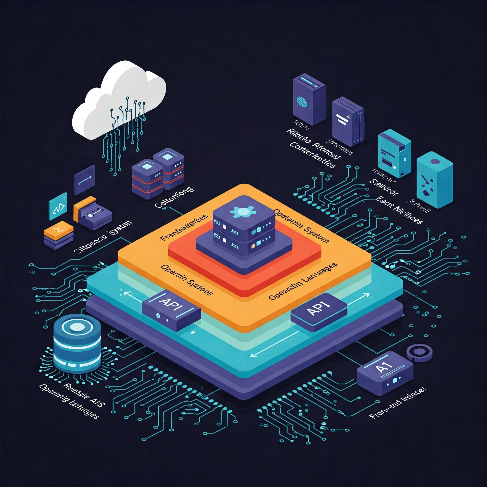

# Hi there, I'm Yogya! 👋

Welcome to my GitHub profile! I'm a 10-year-old developer with a passion for building intelligent systems, AI frameworks, and efficient full-stack applications. I love turning wild ideas into working code that does *amazing* things. (written by chatgpt)

---

## 🚀 About Me

I'm a self-taught programmer who's always curious to learn new technologies and challenge the limits of what's possible on any device—even low-end ones! Whether it’s building a powerful AI assistant, a modular backend system, or experimenting with new data visualizations, I code with heart and soul. (written by chatgpt.)

I spend most of my time:
- Designing and optimizing AI models and logic systems
- Developing with Python (FastAPI, Flask), JavaScript (Node.js)
- Experimenting with web3.py
- Working and fine tuning ollama and hugginfacehub models with modules

---

## 🧠 My Tech Stack

Here are the core technologies I work with regularly:

### **Languages & Frameworks**
- **Python** – My main language for logic, data, AI, and backend work
- **FastAPI** – Lightweight and powerful backend APIs
- **Flask** – Modular microservice-based web architecture
- **Node.js** – Real-time backend and service scripting
- **HTML/CSS/JS** – Web interfaces and frontend logic
- **Web3.py** – Decentralized apps and smart contract integration

### **Data Science & Visualization**
- **NumPy** – High-performance numerical computation
- **Pandas** – Data analysis and processing at scale
- **Matplotlib** – Custom data plotting and graphics
- **Seaborn** – Clean and professional statistical visualizations
- **scikit-learn** – Machine learning workflows and models

---

## 📱

I develop everything using **Termux**, pushing the limits of mobile Linux.

Yes, I build everything **from Android**—and yes, it works smoothly.

---

## 🔧 Modules I Use Daily

Here's a list of the main Python libraries I use and love:

| Module            | Purpose                                  |
|-------------------|-------------------------------------------|
| **NumPy**         | Fast matrix math, arrays, scientific computing |
| **Pandas**        | DataFrames, CSV/JSON reading, wrangling  |
| **Matplotlib**    | Plotting and custom charting              |
| **Seaborn**       | Advanced graphing with themes             |
| **scikit-learn**  | ML models, pipelines, preprocessing       |
| **FastAPI**       | Async backend API design                  |
| **Flask**         | RESTful APIs, microservices               |
| **Web3.py**       | Blockchain interaction, wallet scripting  |

---

## 📫 Let's Connect

Feel free to explore my repositories, raise issues, or just say hi.

**"The code you write today becomes the magic of tomorrow."**

  
  

## My current Project:
- **NeuroShell**:
  NeuroShell is a powerful, AI-integrated command-line shell designed to transform your coding experience—especially on Android (Termux) devices. Unlike traditional shells, NeuroShell blends sleek UI styling with intelligent features like auto aliasing, AI-assisted completions, and a smart integrated editor called neuroEdit. It adapts to your environment, supports custom prompt themes, and learns your usage patterns to boost your productivity. Whether you're managing files, installing packages, or writing Python code, NeuroShell acts like a personal assistant—understanding, responding, and executing with human-like intuition. Built with a coder's heart, it's crafted for lightweight systems like Termux but dreams big, like a universe-level bug solver in your pocket.

Thanks for visiting!

— Yogya  
---
*Junior dev (just learning and practicing)*
